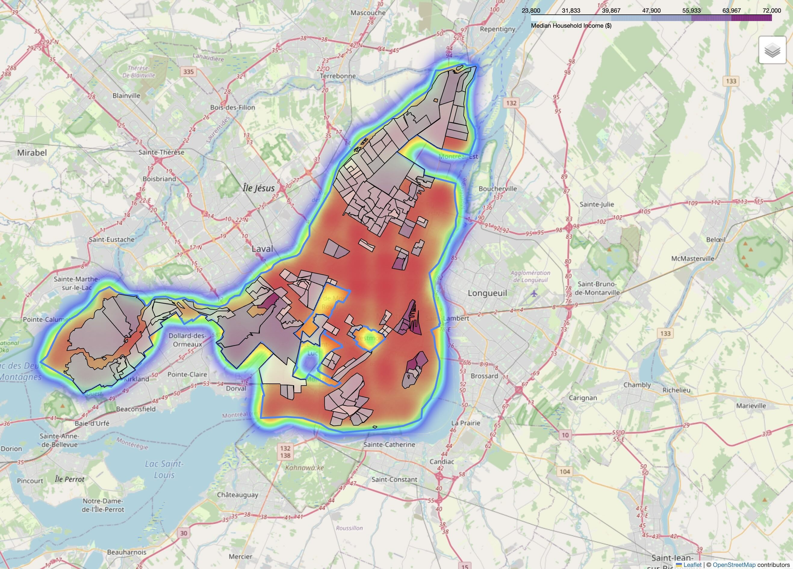

# Montreal Accessibility Analyzer



Food accessibility is a critical urban planning issue that directly impacts community health and equity.
This project analyzes grocery store accessibility across Montreal to identify which neighborhoods are well-served and which face barriers to accessing fresh food.

## Features

- **Interactive accessibility heatmap** showing grocery access patterns across Montreal
- **827 analysis points** covering the entire city boundary
- **Distance calculations** from every location to nearest grocery store
- **5-point accessibility scoring system** (1=Very Poor to 5=Excellent)
- **Socioeconomic analysis** revealing income-based accessibility disparities
- **Income choropleth layer** showing median household income by census tract
- **Toggleable map layers** for boundary, grocery stores, and accessibility heatmap
- **Store information popups** displaying name, brand, and opening hours
- **Statistical analysis** of citywide accessibility patterns

## Data Sources

- **OpenStreetMap (OSM)** - Grocery store locations
- **OSMnx** - Montreal adiministrative boundary and geographic data
- **CensusMapper / Statistics Canada Census 2021** - Median household income by census tract (169 tracts)
- All data retrieved December 2025

## Methodology

1. **Data Collection**:
   - Retrieved Montreal's city boundary and 313 grocery store locations from OpenStreetMap using OSMnx
   - Downloaded Census 2021 income data via CensusMapper API
2. **Grid Generation**: Created 2,500 evenly-spaced points across Montreal's bounding box, filtered to 827 points within city boundaries
3. **Distance Calculation**: Reprojected data to EPSG:32188 (NAD83/Quebec Lambert) for metric calculations; computed straight-line distance from each grid point to nearest store
4. **Accessibility Scoring**: Applied 5-tier scoring system:
   - Score 5 (Excellent): 0-500m
   - Score 4 (Good): 500-1000m
   - Score 3 (Moderate): 1000-2000m
   - Score 2 (Poor): 2000-3000m
   - Score 1 (Very Poor): 3000m+
5. **Socioeconomic Analysis**:
   - Spatially joined grid points with census tract income data
   - Compared accessibility scores between income quartiles (bottom 25% vs top 25%)
6. **Visualization**:
   - Generated interactive heatmap using Folium, with color intensity representing accessibility levels
   - Income choropleth showing census tracts colored by median income

## Key Findings

This analysis reveals a counterintuitive pattern in Montreal's grocery accessibility:

**Income-Accessibility Relationship:**

- **High-income areas (median $48k+) have 38% worse grocery accessibility** than low-income areas (median <$34k)
- Low-income neighborhoods: Average accessibility score of **3.67** (moderate to good access)
- High-income neighborhoods: Average accessibility score of **2.26** (poor access)

**Why This Happens:**

This reflects Montreal's urban geography—lower-income neighborhoods tend to be located in denser, central areas with better walkability and proximity to services, while higher-income residents often live in suburban areas with larger properties but greater car dependency and distances to grocery stores.

**Overall Access Patterns:**

- Only **38.3%** of analyzed locations have good accessibility (within 1km of a grocery store)
- **34.9%** face poor accessibility (over 2km from nearest store)
- Average accessibility score: **2.97 out of 5** (just below moderate)

**Distance Metrics:**

- **Minimum:** 35m (some locations adjacent to stores)
- **Maximum:** 10.8km (peripheral areas significantly underserved)
- **Median:** 1.4km (half of Montreal within walking/biking distance)

**Policy Implications:**
While wealthy areas have worse measured accessibility, this doesn't necessarily indicate inequity—high-income residents typically have car access. However, the finding highlights that **car dependency increases with income** in Montreal, while lower-income residents rely more on walkable access to essential services.

## Technologies Used

- **Python 3.x**
- **GeoPandas** - Spatial data manipulation and analysis
- **OSMnx** - OpenStreetMap data retrieval
- **Folium** - Interactive map visualization
- **Folium.plugins.HeatMap** - Accessibility heatmap layer
- **Pandas** - Data processing and analysis
- **NumPy** - Numerical computations and grid generation
- **Shapely** - Geometric operations
- **CensusMapper API** - Census data retrieval

## How to Run Locally

### Prerequisities

- Python 3.8 or higher
- pip package manager

### Installation

1. Clone the repository
2. Create and activate virtual environment
3. Install dependencies

### Usage

1. Run the analysis
2. View the results

### Notes

- First run may take a few minutes to download OSM data
- CensusMapper data cached locally after first download

## Project Structure

```
montreal-accessibility-analyzer/
├── venv/                      # Virtual environment (not in repo)
├── map_test.py               # Main analysis script
├── index.html                # Generated interactive map
├── README.md                 # Project documentation
└── .gitignore               # Git ignore file
```
